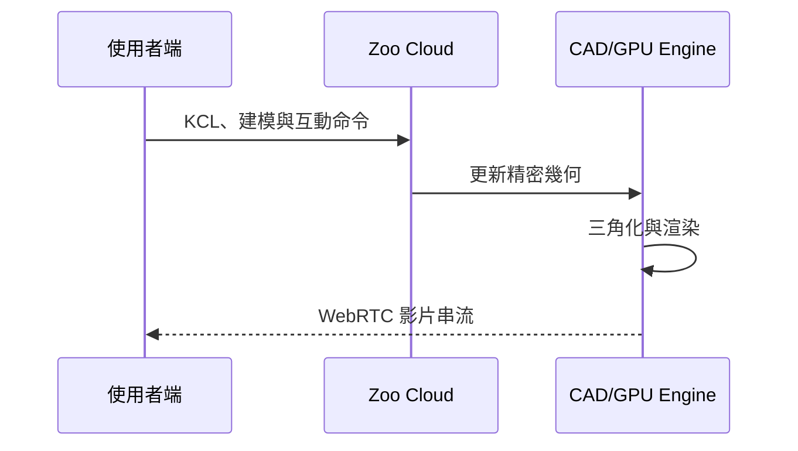
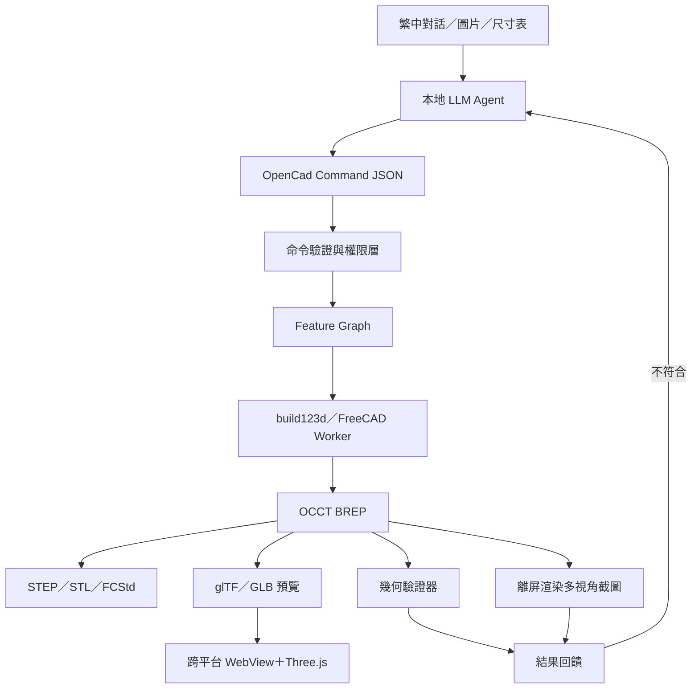
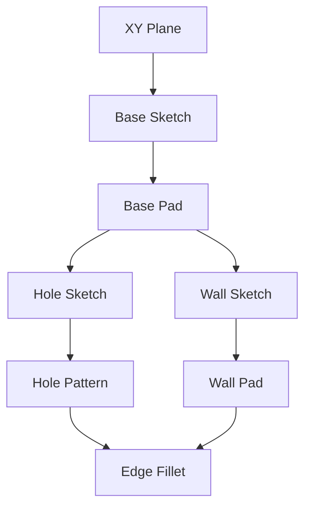

# OpenCad：全本地 LLM 原生參數化機械 CAD 規劃書

> 文件版本：v1.1（v1.0 經技術審查後補強）  
> 日期：2026-07-10  
> 定位：類似 Zoo Design Studio、SOLIDWORKS 與 Autodesk Inventor 的本地端 AI 原生機械 CAD

---

## 1. 專案摘要

OpenCad 是一套以大型語言模型（LLM）為主要操作入口的參數化機械 CAD。使用者可以透過繁體中文、尺寸表、參考圖片或既有模型描述設計需求，由本地 LLM 將工程意圖轉換成受控的 CAD 特徵命令，再交由確定性的幾何引擎建立、修改、驗證及輸出模型。

OpenCad 不以「文字產生一個看起來像零件的 STL」為目標，而是建立：

- 可編輯的參數化草圖
- 可重新計算的特徵歷史樹
- 精確的 BREP 實體幾何
- 可針對單一特徵修改的語意操作
- 可供加工或其他 CAD 軟體使用的 STEP
- 可供 3D 列印使用的 STL／3MF
- 後續可擴展的組立、BOM 與工程圖

核心原則：

> **LLM 負責理解、規劃與選擇工具；CAD 引擎負責精確、可重現及可驗證的幾何計算。**

---

## 2. 產品願景

傳統 CAD 要求使用者先理解草圖、基準面、約束、拉伸、切除、掃掠、組立配合等指令。OpenCad 改以「工程意圖」作為操作入口。

### 傳統操作

1. 選擇 XY 基準面。
2. 建立矩形草圖。
3. 標註長寬。
4. 完全約束草圖。
5. 拉伸成底板。
6. 選取上表面。
7. 建立中心孔與固定孔。
8. 建立陣列。
9. 加入倒角或圓角。

### OpenCad 操作

使用者輸入：

> 建立一個 NEMA17 馬達座，底板 60 × 60 × 5 mm，中心孔直徑 24 mm，使用四個 M3 一般間隙孔，固定孔距依 NEMA17 標準，外圍加 R3 圓角。

OpenCad 將：

1. 解析設計目的與尺寸。
2. 找出缺少或矛盾的條件。
3. 顯示即將執行的建模計畫。
4. 建立草圖、約束及特徵。
5. 驗證外形、孔徑、孔距及實體有效性。
6. 顯示3D模型與特徵樹。
7. 輸出 STEP、STL 與 OpenCad 專案。

---

## 3. 與現有 CAD 的關係

| 能力 | SOLIDWORKS | Autodesk Inventor | Zoo Design Studio | OpenCad 目標 |
|---|---|---|---|---|
| 參數化草圖 | 完整 | 完整 | 支援 | 必須具備 |
| 尺寸／幾何約束 | 完整 | 完整 | 支援 | 必須具備 |
| 特徵歷史樹 | 完整 | 完整 | 支援 | 必須具備 |
| 單零件建模 | 完整 | 完整 | 支援 | 第一階段 |
| 組立與配合 | 完整 | 完整 | 持續發展 | 第二階段 |
| 工程圖 | 完整 | 完整 | 有限／發展中 | 第三階段 |
| BOM | 完整 | 完整 | 有限 | 第二、三階段 |
| CAE／CAM | 擴充模組 | 整合生態 | 發展中 | 串接外部工具 |
| 對話式建模 | 有限 | 有限 | 核心能力 | 核心能力 |
| 本地離線 | 是 | 是 | 主要依賴雲端引擎 | 完全本地 |
| 原始設計語言 | 專有 | 專有／iLogic | KCL | OpenCad Feature JSON |

OpenCad 不應在初期複製所有 SOLIDWORKS／Inventor 功能。正確策略是先建立可靠的單零件參數化建模與 LLM 修改閉環，再逐步擴展組立和工程圖。

---

## 4. Zoo Design Studio 架構分析

Zoo Design Studio 使用 KCL 描述參數化模型，客戶端透過 WebSocket 傳送建模、相機與互動命令。其雲端引擎更新 CAD 幾何、渲染場景、編碼視窗畫面，再透過 WebRTC 將即時影片串流回客戶端。



Zoo 官方資料顯示：

- 3D 視窗是來自託管幾何引擎的影片串流。
- 建模命令透過 WebSocket 傳送。
- 雲端工作階段處理 CAD、渲染與影片編碼。
- 本機主要處理介面和影片解碼。
- Design Studio 應用程式開源，但 CAD 幾何引擎沒有開源。
- Zoo 將其引擎定位為雲端、可採用 GPU compute 與 GPU acceleration 的 CAD 引擎。

參考資料：

- [Zoo Design Studio Stream](https://zoo.dev/docs/zoo-design-studio/features/system-requirements/zoo-stream)
- [Zoo Design Studio GitHub](https://github.com/KittyCAD/modeling-app)
- [Zoo FAQ 與 Zookeeper](https://zoo.dev/docs/faq)
- [Zoo CAD Engine 產品路線](https://zoo.dev/blog/product-launch)

### OpenCad 不照搬 Zoo 雲端串流的原因

- 工程設計資料不能離開本機。
- 雲端 GPU 工作階段有持續成本。
- 網路延遲會影響旋轉、選取與建模體驗。
- WebRTC、GPU 排程和影片編碼會增加大量維運工作。
- OpenCad 第一版的單零件模型可由本機 GPU 流暢顯示。

OpenCad 將借鏡 Zoo 的對話、程式化 CAD、特徵樹與視覺回饋，但改為全本地執行。

---

## 5. 全本地系統架構



### 本地硬體分工

| 工作 | 主要硬體 |
|---|---|
| LLM／VLM 推理 | RTX 5080 16GB |
| 草圖約束求解 | CPU |
| BREP 建立與布林運算 | CPU |
| STEP／STL 輸出 | CPU |
| BREP 三角化 | 主要為 CPU |
| Three.js 即時顯示 | GPU |
| 多視角截圖 | GPU |
| 模型資料與版本 | NVMe SSD |
| 大型模型與 LLM 卸載 | 64GB RAM |

GPU 主要用於 LLM、視覺模型及3D顯示。OpenCascade 等傳統 CAD 幾何核心仍以 CPU 運算為主，因此高單核效能 CPU 對重建速度很重要。

---

## 6. 建議技術選型

| 模組 | 第一版選型 | 說明 |
|---|---|---|
| 桌面應用程式 | C# Avalonia UI／.NET 8 | 跨平台（Windows／macOS／Linux），XAML 開發模式與 WPF 相近，符合現有技術能力 |
| 3D 顯示 | 跨平台 WebView＋Three.js | Windows 用 WebView2、macOS 用 WKWebView、Linux 用 WebKitGTK，前端 Three.js 程式碼三平台共用 |
| CAD 服務 | Python Worker | 便於整合 FreeCAD 與 build123d |
| 快速幾何建模 | build123d | Python API 清楚，適合 LLM 與測試 |
| 完整參數 CAD | FreeCAD Python | 草圖、特徵、文件與 FCStd |
| 幾何核心 | OpenCascade／OCCT | 精確 BREP 與 STEP |
| 本地 LLM | Ollama／llama.cpp | 完全離線、OpenAI-compatible API |
| 本地 VLM | 可抽換 Provider | 讀取草圖與預覽圖 |
| 程序通訊 | localhost HTTP（FastAPI） | 三平台行為一致；Named Pipe 在 Unix 上實作差異大，第一版避免使用 |
| 顯示格式 | GLB／glTF | 輕量、瀏覽器顯示方便 |
| 工業交換 | STEP | 保留精確幾何 |
| 3D 列印 | STL／3MF | 支援切片軟體 |
| 專案資料 | SQLite＋JSON | 查詢、版本與設定 |
| 日誌 | Serilog＋結構化 CAD Log | 追蹤每次模型重建 |

### 跨平台策略（Windows／macOS／Linux）

OpenCad 必須在三大桌面平台上以同一套程式碼運行。各層的跨平台狀況：

| 層 | 跨平台方式 | 注意事項 |
|---|---|---|
| UI Shell | Avalonia UI（.NET 8） | 取代 Windows 專屬的 WPF；XAML 與 MVVM 模式可直接沿用 |
| 3D Viewport | Three.js（三平台共用） | WebView 宿主依平台不同：WebView2／WKWebView／WebKitGTK |
| CAD Worker | Python＋build123d／OCCT | OCP wheel 三平台皆有；FreeCAD 三平台皆有官方版 |
| LLM 推理 | Ollama／llama.cpp | Windows／Linux 走 CUDA，macOS 走 Metal，API 介面一致 |
| 程序通訊 | localhost HTTP | 避免平台特定 IPC |
| 檔案與路徑 | .NET `Path` API＋UTF-8 | 禁止硬編路徑分隔符；專案路徑可能含非 ASCII 字元（如中文），所有 I/O 一律 UTF-8 |

其他跨平台原則：

- **CI 矩陣**：從 Phase 0 起就在三平台跑建置與幾何測試（GitHub Actions 的 windows／macos／ubuntu runner），不要等到後期才移植——WebView 宿主與 Worker 打包是最容易出現平台差異的兩處。
- **GPU 差異**：文件第 5 節的硬體分工以開發機（RTX 5080）為例；macOS 上 LLM 推理由 Metal 承擔，幾何運算仍為 CPU，架構不變。
- **保底方案**：若跨平台 WebView 控件成熟度不足，備案是把 UI 整體換成 Tauri（前端 TypeScript＋Three.js，後端 Rust 薄殼），CAD Worker 與 LLM 層完全不受影響——這正是「UI 與引擎以 HTTP 解耦」帶來的彈性。

### CI/CD 與三平台一鍵安裝包

發行目標：使用者在任一平台下載**單一安裝檔，雙擊即可完成安裝**，不需自行安裝 .NET、Python 或任何依賴。

| 平台 | 安裝包格式 | 打包工具 | 說明 |
|---|---|---|---|
| Windows | `.exe` 安裝精靈（或 MSIX） | Inno Setup | 自含式 .NET（win-x64）＋內嵌 Python Worker |
| macOS | `.dmg` | create-dmg＋codesign | osx-x64 與 osx-arm64 雙架構；正式發行需 Apple notarization |
| Linux | `.AppImage` | appimagetool | 單一可執行檔、免安裝；另可加發 Flatpak |

CI/CD 管線（GitHub Actions）：

1. **CI（每次 push／PR）**：三平台矩陣建置＋單元測試＋幾何 Golden Model 測試。
2. **Release（打 tag 觸發，如 `v0.1.0`）**：
   - `dotnet publish -r <rid> --self-contained` 產出各平台自含式主程式。
   - conda-pack 打包 Python CAD Worker（含 build123d／OCCT），隨安裝包附帶。
   - 各平台 runner 產生對應安裝包並簽章。
   - 自動上傳至 GitHub Releases，附 SHA-256 校驗檔。
3. **自動更新**：桌面端整合 Velopack（跨平台 .NET 自動更新框架），使用者免手動重裝。

注意事項：

- LLM 模型檔（數 GB）**不放入安裝包**；首次啟動時引導使用者透過 Ollama 拉取，或提供離線模型匯入。
- macOS 簽章與 notarization 需 Apple Developer 帳號；未簽章版本僅供開發測試。
- 安裝包體積主要來自 OCCT／FreeCAD 依賴，Linux AppImage 與 Windows 安裝檔預估 300–600 MB，屬正常範圍。

### 為什麼同時使用 build123d 和 FreeCAD

build123d 適合：

- LLM 生成機械零件
- 無介面、自動化建模
- 幾何單元測試
- STEP／STL 輸出
- 簡潔、可維護的 Python 程式

FreeCAD 適合：

- 草圖約束
- 特徵文件模型
- 人工後續編輯
- FCStd 保存
- 組立與工程圖的未來擴展

第一版可優先使用 build123d 建立可靠的建模閉環，再逐步把需要互動編輯的特徵映射到 FreeCAD。

### 重要限制：build123d 沒有草圖約束求解器

build123d 是程式式（code-CAD）建模：草圖幾何由程式直接計算位置，**不存在**「相切、對稱、等長」這類可求解的約束系統。規劃時必須明確區分三個層次，否則第 9.2 節的約束清單會變成無法兌現的承諾：

1. **第一版（build123d）**：約束以宣告式中繼資料保存在 Feature Graph，幾何由參數直接計算；約束僅用於「重建後驗證是否仍成立」。
2. **需要真正求解時**：整合 SolveSpace 求解器（`py-slvs`／`python-solvespace`）作為獨立的求解步驟，輸入約束、輸出座標，再交給 build123d 建模。
3. **完整互動式約束編輯**（拖曳草圖、欠約束／過約束提示）：留給 FreeCAD Sketcher 階段。

### 雙引擎的遷移風險

build123d 與 FreeCAD 的特徵語意不完全相同（Fillet 邊選取、Shell 開口面、Pattern 參照方式都有差異）。因此 Feature Graph 必須維持**引擎中立**：特徵只描述意圖與參數，由各 Adapter 負責轉譯；並用同一組 Golden Model 在兩個引擎上比對結果，避免日後遷移時需要重寫專案檔。

### FreeCAD 嵌入方式的注意事項

FreeCAD 自帶專屬 Python 環境，直接把其模組載入外部 venv 常因 Python 版本不符而失敗。建議以 `FreeCADCmd` 子程序或 conda 版 `freecad` 套件隔離執行，這也與第 14 節的 Worker 隔離原則一致。

### 授權盤點

- build123d：Apache 2.0
- OCCT：LGPL 2.1（含例外條款）
- FreeCAD：LGPL 2.0+
- Three.js：MIT

以子程序／動態連結方式使用 LGPL 元件可避免衍生著作疑慮，但正式散布前應完成完整授權盤點。

參考：

- [build123d 官方文件](https://build123d.readthedocs.io/)
- [FreeCAD Python Scripting Tutorial](https://wiki.freecad.org/Python_scripting_tutorial)
- [FreeCAD 功能](https://www.freecad.org/features.php)

---

## 7. LLM 不得直接控制幾何核心

不應讓 LLM 每次重新輸出整份 Python 或 OpenSCAD 程式。這會造成：

- 修改一個孔時，其他尺寸被意外改變。
- 特徵名稱和參照面不穩定。
- 無法可靠 Undo／Redo。
- 無法清楚比較修改差異。
- 模型難以跨 LLM 重現。
- 惡意或錯誤程式可能存取檔案和程序。

OpenCad 應讓 LLM 產生受限的命令，再由確定性執行器處理。

### 命令範例

```json
{
  "schema_version": "1.0",
  "action": "update_feature",
  "document_id": "scanner_enclosure",
  "target_feature_id": "motor_mount_holes",
  "parameters": {
    "standard": "M5",
    "fit": "normal_clearance"
  },
  "preserve": [
    "body.outer_dimensions",
    "screen_cutout",
    "rail_mount"
  ]
}
```

### 標準件資料必須查表，不得依賴 LLM 記憶

上例中 `"standard": "M5"` 與 `"fit": "normal_clearance"` 對應的實際孔徑（5.5 mm）必須由引擎內建的確定性資料表查得——例如 ISO 273 間隙孔、NEMA 安裝尺寸（NEMA17 孔距 31 × 31 mm）、常用螺絲沉頭尺寸。LLM 只選擇「標準與等級」，數值一律查表。資料表與 Command Schema 一起版本控管，這也是「LLM 負責選擇、引擎負責精確」原則的直接落實。

### 執行流程

1. LLM 產生命令草稿。
2. JSON Schema 驗證欄位與型別。
3. 工程規則檢查單位、尺寸與範圍。
4. 顯示修改摘要和風險。
5. 使用者套用修改。
6. Feature Graph 更新。
7. CAD Worker 重建模型。
8. 驗證器比較修改前後模型。
9. 通過後建立新版本。

---

## 8. OpenCad Feature Graph

Feature Graph 是 OpenCad 的核心資料結構。它不能只保存最終 STL，必須保存設計意圖和依賴關係。



每個特徵至少需要：

- 唯一且穩定的 `feature_id`
- 類型
- 輸入參照
- 參數
- 單位
- 依賴特徵
- 建立來源
- LLM 設計說明
- 驗證條件
- 重建狀態
- 錯誤訊息

### 特徵範例

```json
{
  "feature_id": "base_plate",
  "type": "pad",
  "name": "馬達座底板",
  "input": "base_sketch",
  "parameters": {
    "length": { "value": 60, "unit": "mm" },
    "width": { "value": 60, "unit": "mm" },
    "thickness": { "value": 5, "unit": "mm" }
  },
  "validation": {
    "min_thickness_mm": 3,
    "must_be_single_solid": true
  }
}
```

### 重建與刪除策略

- **增量重建**：修改特徵時，依拓撲排序只重建其下游依賴子圖，上游特徵的 BREP 結果快取重用；否則稍大的模型每次修改都全量重建，互動延遲會迅速惡化。
- **刪除相依處理**：刪除被其他特徵依賴的特徵時，必須先列出所有受影響特徵，由使用者選擇「連同刪除」或「取消」；禁止靜默刪除或留下懸空參照。
- **單位正規化**：Feature Graph 內部一律以 mm 為正準單位保存，其他單位（inch、cm）在命令進入時換算，避免混合單位在圖中流動。

---

## 9. 第一版支援範圍

### 9.1 草圖實體

- 點
- 線
- 圓
- 圓弧
- 矩形
- 長圓孔
- 多邊形
- 建構線

### 9.2 草圖約束

> 注意：第一版以 build123d 為引擎時，以下約束屬於**宣告式中繼資料**（保存意圖、供驗證與日後遷移 FreeCAD Sketcher 使用），實際幾何位置由參數直接計算，並非由求解器求解。詳見第 6 節「重要限制」。

- 水平
- 鉛直（Vertical）
- 平行
- 互相垂直（Perpendicular）
- 同心
- 相切
- 重合
- 等長
- 距離
- 半徑／直徑
- 角度
- 對稱

### 9.3 3D 特徵

- Pad／Extrude
- Pocket／Cut
- Revolve
- Hole
- Linear Pattern
- Circular Pattern
- Mirror
- Fillet
- Chamfer
- Shell
- Boolean Union／Difference／Intersection

### 9.4 工程輸出

- OpenCad Project
- STEP
- STL
- 3MF
- GLB
- 預覽 PNG
- 尺寸與驗證報告

### 9.5 第一版暫不處理

- 複雜曲面 Class-A
- 大型組立
- 完整鈑金展開
- FEA／CFD
- CNC Toolpath
- 複雜齒輪接觸模擬
- 全自動製造安全認證

---

## 10. 幾何驗證

LLM 和預覽圖片不能作為模型正確性的唯一依據。OpenCad 必須以幾何資料驗證。

### 基本檢查

- BREP 是否有效
- 是否為封閉實體
- 實體數量是否符合預期
- Bounding Box 是否符合外形尺寸
- 孔的數量、直徑與位置
- 零件是否有零體積或重複面
- Fillet／Chamfer 是否建立成功
- 最小壁厚
- 零件是否存在干涉
- 應接觸的零件是否真的接觸
- 應保留的參數是否沒有改變

### 模型驗收範例

```python
assert model.is_valid()
assert model.solid_count == 1
assert abs(model.size_x - 113.4) < 0.05
assert abs(model.size_y - 54.0) < 0.05
assert detected_hole_count == 50
assert minimum_wall_thickness >= 2.0
```

### 視覺驗證

系統產生：

- 等角視圖
- 正視圖
- 俯視圖
- 右視圖
- 剖面視圖

本地 VLM 可檢查外觀是否符合需求，但 VLM 結果只作輔助，最終尺寸仍以 BREP 和參數驗證為準。

多視角截圖**不得依賴桌面介面（Avalonia／WebView）產生**：驗證流程需要無頭（headless）離屏渲染——例如 OCCT 內建的離屏截圖、或以 trimesh／pyrender 渲染三角化結果——批次測試與自動化流程才能在沒有 GUI 的環境執行。WebView2 只負責互動顯示，不承擔驗證職責。

---

## 11. 使用者介面規劃

```text
┌──────────────┬────────────────────────────┬──────────────────┐
│ 專案／特徵樹 │          3D 模型視窗       │    AI 對話       │
│              │                            │                  │
│ Body         │                            │ 建立 NEMA17      │
│ ├ Sketch001  │                            │ 馬達座，底板...  │
│ ├ Pad001     │                            │                  │
│ ├ HoleGroup  │                            │ [產生計畫]       │
│ └ Fillet001  │                            │ [套用修改]       │
├──────────────┴────────────────────────────┴──────────────────┤
│ 參數｜約束｜驗證｜程式｜版本差異｜STEP／STL 輸出           │
└─────────────────────────────────────────────────────────────┘
```

### 必要互動

- 選取面、邊、實體或特徵後詢問 LLM。
- 點擊 LLM 回覆中的特徵可在3D畫面高亮。
- 執行前顯示修改計畫。
- 執行後顯示修改前後差異。
- 可接受、拒絕或回復修改。
- 尺寸可由表格直接人工修改。
- LLM 與人工操作使用相同的命令系統。

### 修改確認範例

```text
預計修改：

1. 將四個 motor_mount_holes 由 M3 改成 M5 一般間隙孔。
2. 孔中心位置保持不變。
3. 底板外形、厚度與中心孔保持不變。
4. 修改後將檢查孔壁至邊緣的最小距離。

[套用] [修改計畫] [取消]
```

---

## 12. 本地 LLM 架構

OpenCad 不應綁死單一模型。建議定義：

```csharp
public interface ILlmProvider
{
    Task<DesignPlan> CreatePlanAsync(DesignContext context);
    Task<CadCommand> CreateCommandAsync(DesignPlan plan);
    Task<ReviewResult> ReviewResultAsync(GeometryReport report);
}
```

可支援：

- Ollama
- llama.cpp server
- vLLM（需要合適環境）
- 其他 OpenAI-compatible 本地服務

### 結構化輸出保證

僅靠提示詞無法保證 LLM 每次輸出合法 JSON。應使用推理端的受限解碼（constrained decoding），由 Command Schema 直接生成解碼文法，讓「不合法 JSON」在生成階段就不可能出現：

- llama.cpp：GBNF grammar
- Ollama：`format` 傳入 JSON Schema 的結構化輸出
- vLLM：guided decoding（outlines／xgrammar）

如此重試邏輯只需處理**語意錯誤**（尺寸矛盾、參照不存在），不必處理格式錯誤。

### 修復迴圈必須有上限

Repair Agent 的「失敗 → 修正 → 重建」迴圈必須限制重試次數（建議 3 次），超過即停止並升級為人工介入，同時保留完整失敗紀錄。否則局部幾何失敗（如半徑過大的 Fillet）可能讓系統無限重試。

### 模型分工

不必讓單一大型模型完成全部工作：

| Agent | 任務 |
|---|---|
| Planner | 將需求拆成建模步驟 |
| Command Generator | 產生受控 JSON Command |
| Geometry Reviewer | 讀取幾何檢查報告 |
| Vision Reviewer | 分析多視角預覽 |
| Repair Agent | 針對失敗特徵提出局部修正 |

所有 Agent 都只能透過受控工具操作模型，不能直接存取任意檔案或執行任意 Shell 指令。

---

## 13. 專案檔案格式

```text
NEMA17_Mount/
├─ project.opencad
├─ manifest.json
├─ parameters.json
├─ features.json
├─ constraints.json
├─ validation.json
├─ generated/
│  ├─ model.py
│  ├─ model.step
│  ├─ model.stl
│  ├─ model.3mf
│  └─ preview.glb
├─ previews/
│  ├─ isometric.png
│  ├─ top.png
│  ├─ front.png
│  └─ right.png
└─ revisions/
   ├─ 0001.json
   ├─ 0002.json
   └─ 0003.json
```

### `generated/model.py` 的定位

`generated/model.py` 由確定性 Adapter 依 `features.json` 產生，**LLM 不得直接撰寫或修改此檔案**（與第 7 節原則一致）。它只是可重現的建置產物，可隨時從 Feature Graph 重新生成；真正的設計來源（source of truth）永遠是 `features.json`＋`parameters.json`。

### `project.opencad`

可採 ZIP 容器封裝所有 JSON、縮圖和必要模型；開發階段先使用目錄形式，方便除錯與 Git Diff。

### 版本紀錄

每次修改至少保存：

- 使用者原始要求
- LLM 建模計畫
- 實際執行命令
- 修改前後參數
- 幾何檢查結果
- 執行時間
- 使用的模型與版本
- 是否由使用者接受

---

## 14. 程序與安全設計

### CAD Worker 隔離

CAD Worker 應採獨立程序：

- 主程式不直接載入 FreeCAD／OCCT DLL。
- 每次建模工作有 Timeout。
- 可取消或終止失去回應的 Worker。
- stdout／stderr 使用結構化訊息。
- Worker Crash 不應造成桌面主程式關閉。
- 每次生成在獨立工作目錄中執行。

### 結構化錯誤格式

Worker 失敗時必須回傳結構化錯誤，Repair Agent 只消費此結構，不解析原始 stack trace：

```json
{
  "error_code": "FILLET_RADIUS_TOO_LARGE",
  "failed_feature_id": "edge_fillet_01",
  "stage": "rebuild",
  "engine_message": "BRepFilletAPI_MakeFillet: radius exceeds adjacent face size",
  "suggestion_scope": "reduce_radius_or_split_edges"
}
```

錯誤代碼採固定枚舉並隨 Schema 版本控管，這讓 Repair Agent 的提示詞可以針對每類錯誤寫明確的修復策略。

### 命令白名單

允許：

- 建立草圖實體
- 加入約束
- 建立已支援的特徵
- 更新參數
- 刪除指定特徵
- 重建與輸出

禁止：

- 任意 Python `eval`／`exec`
- 任意 Shell 指令
- 存取專案外檔案
- 自行下載套件
- 修改系統設定
- 未經確認覆寫原始版本

---

## 15. API 初步設計

### 建立專案

```http
POST /api/projects
```

### 產生設計計畫

```http
POST /api/projects/{id}/agent/plan
```

### 套用命令

```http
POST /api/projects/{id}/commands
```

### 重建模型

```http
POST /api/projects/{id}/rebuild
```

### 取得預覽

```http
GET /api/projects/{id}/preview.glb
```

### 驗證模型

```http
POST /api/projects/{id}/validate
```

### 匯出模型

```http
POST /api/projects/{id}/exports
```

### 重建進度串流

```http
GET /api/projects/{id}/events
```

長時間重建（布林、Fillet、大型陣列）需以 SSE 或 WebSocket 逐特徵回報進度與狀態，避免 UI 凍結在單一 POST 請求上；同一通道也用於推送驗證結果與 Worker 錯誤。

本地版本只監聽 `127.0.0.1`，並使用隨機工作階段 Token，避免其他本機程序任意呼叫。

---

## 16. 第一版 MVP

### MVP 目標

> 使用繁體中文建立、預覽、修改並輸出一個可量尺寸的參數化機械零件，全程不連接雲端。

### 驗收條件

- 能以繁體中文描述單一零件。
- LLM 先產生可審查的建模計畫。
- 建模計畫能轉成受控 JSON Command。
- 能建立矩形、圓、孔、拉伸、切除、陣列、圓角及薄殼。
- 左側顯示可選取的特徵樹。
- 3D 視窗可旋轉、縮放、平移與選取。
- 可說「把這四個孔改成 M5」。
- 只修改目標特徵，不重寫整個模型。
- 修改後自動重建和驗證。
- 能顯示外形尺寸、體積、表面積和孔數。
- 可輸出 STEP、STL、GLB。
- 關閉後重新開啟仍能繼續修改。
- 網路完全中斷時仍能操作。

### MVP 示範模型

建議使用三個由簡至難的模型：

1. NEMA17 馬達座：測試標準孔位、孔徑與圓角。
2. 5 × 10 針盒：測試孔陣列、外形和孔數驗證。
3. ESP32-CAM 掃描器外殼：測試薄殼、開孔、螺絲柱與線槽。

---

## 17. 開發里程碑

### Phase 0：技術驗證

- Avalonia 主程式啟動 Python CAD Worker（三平台）。
- build123d 建立測試零件。
- 輸出 STEP、STL、GLB。
- 跨平台 WebView 顯示 GLB（Windows／macOS／Linux 各驗證一次）。
- 本地 LLM 產生固定 Schema 的 JSON。
- 建立三平台 CI 建置矩陣。

### Phase 1：單零件 AI CAD

- OpenCad Command Schema。
- Feature Graph。
- 特徵重建。
- 參數面板。
- 修改確認與 Undo／Redo。
- 幾何基本驗證。

### Phase 2：選取與局部修改

- 面、邊、Body、Feature 選取。
- Persistent Reference 策略。
- 對選取目標提出 LLM 指令。
- 修改前後視覺與參數差異。

### Phase 3：圖片與草圖輸入

- 尺寸圖解析。
- 輪廓辨識。
- 使用者確認比例和尺寸。
- 圖片轉草圖後再參數化。

### Phase 4：組立

- 零件實例。
- 固定、同心、重合、距離和角度配合。
- 自由度顯示。
- 干涉檢查。
- 爆炸圖與 BOM。

### Phase 5：工程圖與製造規則

- 標準視圖與剖視圖。
- 自動尺寸建議。
- 公差、材料和表面處理。
- PDF／DXF 工程圖。
- 3D 列印可製造性檢查。

---

## 18. 主要技術風險

| 風險 | 說明 | 對策 |
|---|---|---|
| Topological Naming | 特徵重建後面／邊 ID 改變 | 穩定語意引用（如「base_pad 頂面」）＋法向／面積幾何匹配；FreeCAD 1.0 起已內建 TNP 緩解可沿用 |
| 雙引擎語意差異 | build123d 與 FreeCAD 特徵行為不同，遷移成本高 | Feature Graph 引擎中立＋Adapter 轉譯層＋同組 Golden Model 雙引擎比對 |
| FreeCAD Python 綁定 | FreeCAD 自帶 Python，與外部 venv 版本衝突 | FreeCADCmd 子程序或 conda 版 freecad 套件隔離 |
| 修復迴圈失控 | Repair Agent 反覆重試消耗資源 | 重試上限（3 次）後升級人工介入 |
| LLM 誤解需求 | 指令正確但工程意圖錯誤 | 執行前計畫確認 |
| LLM 產生無效參數 | 尺寸矛盾或超出範圍 | 受限解碼保證格式＋JSON Schema＋工程規則 |
| Fillet／Boolean 失敗 | 幾何退化或半徑過大 | 局部修復和清楚錯誤報告 |
| FreeCAD API 複雜 | 文件與版本差異 | 封裝成穩定 OpenCad Adapter |
| 本地模型能力有限 | 16GB VRAM 無法跑超大模型 | 小型專用 Agent＋量化＋RAM卸載 |
| 大型組立效能 | Mesh、記憶體和重建成本 | 延遲載入、LOD、實例化 |
| 圖片缺乏尺寸 | 單張照片無法得知真實比例 | 強制基準尺寸或標尺 |
| 跨平台 WebView 差異 | 三平台 WebView 宿主行為與成熟度不一 | Phase 0 即建立三平台 CI；備案為 Tauri 前端，引擎層不受影響 |
| Worker 跨平台打包 | Python／OCCT／FreeCAD 依賴體積大且平台各異 | conda-pack 或內嵌 Python 隨附發行，三平台各自打包驗證 |

---

## 19. 測試策略

### 單元測試

- Command Schema
- 單位換算
- 參數範圍
- Feature Graph 拓撲排序
- 特徵新增／修改／刪除

### 幾何測試

- Bounding Box
- 體積
- 表面積
- 孔數與孔徑
- 實體數量
- BREP Validity
- 干涉體積

### 邊界測試

正常路徑測試不足以保證可靠性；CAD 系統的多數崩潰都發生在邊界與退化幾何。以下每一類都必須有明確的**預期行為**（拒絕並回報結構化錯誤，或正確處理），不允許未定義行為：

**參數邊界**

- 數值為 0、負數、極小值（0.001 mm）、極大值（10000 mm）
- 厚度等於 0 或等於板長（Pocket 穿透整個實體）
- Fillet 半徑等於相鄰邊長的一半（退化臨界點）、大於相鄰面（必定失敗）
- Shell 壁厚大於等於零件最小尺寸的一半（掏空後無實體）
- 預期：超出工程規則範圍 → 命令驗證層拒絕；範圍內但幾何失敗 → Worker 回報 `error_code`，模型回復到修改前狀態

**幾何退化**

- 孔直徑大於底板、孔中心落在邊緣或角落（半孔）、兩孔重疊或相切
- 陣列數量為 0、1、及大量（如 1000 孔）的效能與正確性
- 布林運算結果為空（切除範圍完全在實體外）、產生多個分離實體
- 相切面／共面布林（OCCT 經典失敗場景）
- 預期：驗證器必須偵測 `solid_count` 與零體積異常，不得輸出破損 STEP

**Feature Graph 邊界**

- `feature_id` 重複、參照不存在的特徵、循環依賴（A→B→A）
- 刪除整條依賴鏈的根特徵
- 空專案（無任何特徵）的重建、輸出與存檔
- 單一命令修改後其下游全部重建失敗的回復（rollback）行為

**單位與數值精度**

- inch／cm 換算後的捨入誤差累積（如 0.1 inch × 1000 次）
- 尺寸驗證容差邊界值（誤差恰好等於 0.05 mm 時判定為何）
- 極端長寬比（0.1 × 1000 mm 薄片）的三角化與顯示

**LLM 輸入邊界**

- 矛盾需求：「底板 60 mm，中心孔直徑 80 mm」→ 必須提問，不得自行猜測
- 同句混用單位：「底板 60 mm、厚 0.5 cm」
- 不存在的標準：「M3.7 螺絲孔」→ 查表失敗必須回報，不得編造孔徑
- 空輸入、超長輸入、與 CAD 無關的輸入
- 預期：LLM 層的邊界全部收斂到「計畫確認」步驟攔截，不允許到達幾何引擎

**檔案與環境邊界**

- 專案路徑含中文與空白（本專案路徑即為實例）、Windows 260 字元路徑限制
- 唯讀目錄、磁碟空間不足時的存檔行為（不得損毀既有 revisions）
- Worker 逾時、被強制終止後主程式的狀態恢復
- Undo 到空堆疊、Redo 在新命令套用後失效

邊界測試與 Golden Model 一樣納入三平台 CI，每新增一種特徵類型，必須同步新增該特徵的參數邊界與退化幾何測試。

### Golden Model

保留經人工確認的標準 STEP，將每次重建結果與基準模型比較：

- 體積差異
- 外形尺寸差異
- 面／邊數差異
- Hausdorff Distance 或 Mesh Distance
- 關鍵特徵位置

### LLM 測試

建立固定繁中提示集，例如：

- 「把中心孔改成 25 mm，其他尺寸不要動。」
- 「四個孔改成 M4 一般間隙孔。」
- 「外殼壁厚增加到 2.5 mm，但外形尺寸不變。」
- 「移除右側線槽，保留左側線槽。」

檢查 LLM 是否產生正確、最小範圍的 Command。

---

## 20. 建議專案目錄

```text
OpenCad/
├─ src/
│  ├─ OpenCad.Desktop/
│  ├─ OpenCad.Application/
│  ├─ OpenCad.Domain/
│  ├─ OpenCad.Infrastructure/
│  ├─ OpenCad.Llm/
│  ├─ OpenCad.Viewer/
│  └─ OpenCad.CadWorker/
├─ schemas/
│  ├─ command.schema.json
│  ├─ feature.schema.json
│  └─ project.schema.json
├─ cad-worker/
│  ├─ adapters/
│  │  ├─ build123d_adapter.py
│  │  └─ freecad_adapter.py
│  ├─ validators/
│  └─ exporters/
├─ tests/
│  ├─ unit/
│  ├─ geometry/
│  ├─ prompts/
│  └─ golden-models/
├─ examples/
│  ├─ nema17-mount/
│  ├─ needle-box-5x10/
│  └─ esp32cam-enclosure/
└─ docs/
```

---

## 21. 最終技術決策

OpenCad 第一版採用：

- **全本地運行**，模型與提示詞不離開電腦。
- **跨平台支援**，Windows、macOS、Linux 使用同一套程式碼。
- **C# Avalonia UI＋跨平台 WebView** 建立桌面介面。
- **Three.js** 使用本機 GPU 顯示3D模型。
- **本地 LLM／VLM** 理解繁中需求與預覽圖。
- **OpenCad Command JSON** 作為 LLM 和 CAD 的安全邊界。
- **Feature Graph** 保存可修改的設計意圖。
- **build123d** 作為第一版快速、可測試的建模引擎。
- **FreeCAD Python** 提供草圖、特徵與後續組立能力。
- **OpenCascade** 建立精確 BREP 並輸出 STEP。
- **幾何驗證器** 取代只靠視覺判斷的做法。
- **GLB** 用於快速預覽，**STEP** 用於工程交換，**STL／3MF** 用於3D列印。

OpenCad 的核心競爭力不是取代所有 CAD 按鈕，而是讓使用者用工程語言描述目的，讓 Agent 規劃並操作參數化 CAD，同時保留專業 CAD 所需的精度、可編輯性、驗證能力和版本歷史。

---

## 22. 建議的第一個開發任務

建立最小垂直切片：

1. Avalonia 主程式顯示 AI 對話與 WebView 3D 區域。
2. 本地 LLM 將 NEMA17 馬達座提示轉成固定 JSON Schema。
3. Python Worker 接收 JSON。
4. build123d 生成馬達座。
5. 驗證外形、中心孔、四個固定孔及孔距。
6. 輸出 STEP、STL、GLB。
7. Three.js 顯示 GLB。
8. 使用者輸入「四個孔改成 M5」。
9. 系統只更新孔特徵並重新驗證。
10. 保存兩個可回復的版本。

完成這條垂直切片，就能驗證 OpenCad 最重要的價值：

> **本地 LLM 能否可靠地建立、修改並驗證真正可製造的參數化 CAD，而不只是生成一張3D圖片或不可編輯的網格。**
