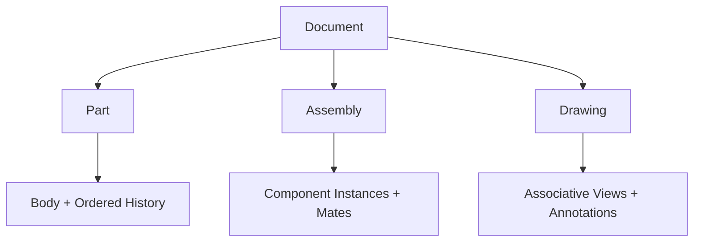

# OpenCad 架構審閱：距離 SolidWorks 類產品還缺什麼

> 審閱文件：`OpenCad_Local_AI_CAD_Architecture.md` v1.1  
> 審閱日期：2026-07-11  
> 審閱目標：不是只做「LLM 產生 3D」，而是做出可日常使用、接近 SolidWorks 工作方式的本地 AI 機械 CAD

---

## 1. 直接結論

這份計畫已經是一份**不錯的本地 AI 單零件 CAD 架構**，尤其以下方向正確：

- LLM 不直接操作幾何核心。
- 使用受控 Command JSON。
- 保存 Feature Graph，而非只輸出 STL。
- BREP 與參數驗證優先於圖片判斷。
- CAD Worker 程序隔離。
- 有版本、Undo/Redo、Golden Model 與跨平台意識。
- 知道 build123d 沒有真正的草圖求解器。
- 已意識到 Topological Naming 與雙引擎風險。

但是，如果目標是「跟 SolidWorks 一樣」，目前計畫仍主要停留在：

> **AI 驅動的參數化單零件產生器＋基本 Feature Tree**

還不是：

> **可供機械工程師每天使用的完整 CAD 設計環境**

SolidWorks 的核心不只是 Extrude、Hole、Fillet 數量多，而是以下能力能一起可靠運作：

1. 真正可拖曳、可診斷自由度的草圖約束求解。
2. 穩定的歷史式特徵、參照、配置與設計意圖。
3. 人工操作與 AI 操作使用同一個精確編輯系統。
4. 多 Body、組立、配合、BOM 與工程圖全程關聯。
5. 鈑金、焊件、模具、標準件等機械工作流程。
6. 大型模型效能、檔案關聯、版本與資料管理。

SOLIDWORKS 官方也把 parts、assemblies、production-ready associative drawings、sheet metal、weldments、mold、routing、Toolbox 與資料管理列為完整產品能力，而非附帶功能。[SOLIDWORKS Design 官方產品頁](https://www.solidworks.com/product/solidworks-design)

### 最重要的判斷

如果你的真正目標是：

- **A. 讓 AI 快速生成可製造單零件**：目前架構方向約有 70～80% 正確。
- **B. 做一套 SolidWorks 類日常機械 CAD**：目前只完成約 25～35% 的產品規格。
- **C. 功能廣度真正追平 SolidWorks**：這是多年、多人、需要成熟核心與大量領域工具的產品，不適合把它包成幾個 Phase 就視為可完成。

我建議把產品目標定為：

> **「SolidWorks 類的核心工作方式＋AI 原生操作」，而不是第一天追求 SolidWorks 全功能數量。**

---

## 2. 目前計畫評分

| 領域 | 目前成熟度 | 判斷 |
|---|---:|---|
| AI/Command 安全架構 | 8/10 | 方向成熟，只需補交易與 Repair 規則 |
| 單零件基本 BREP | 6/10 | 可做 MVP，但 feature breadth 不足 |
| Feature Graph | 5/10 | 有概念，缺 Body、順序、Configuration 與狀態模型 |
| 草圖系統 | 3/10 | 中繼資料約束不是 CAD Sketcher |
| Topology/Persistent Reference | 3/10 | 有列風險，尚無可執行資料模型 |
| 人工 CAD 編輯體驗 | 2/10 | 目前以 AI/參數表為主，缺完整 Sketch/Feature UI |
| 3D 精確選取與顯示 | 3/10 | GLB 可顯示，但尚未定義 BREP face/edge 對應 |
| 多 Body/Configuration | 2/10 | 幾乎未規劃 |
| 組立 | 2/10 | 只有功能清單，缺文件模型與 solver 架構 |
| 工程圖/PMI | 2/10 | 只有里程碑，缺關聯標註與標準模型 |
| 鈑金/焊件 | 1/10 | 被列為未處理，沒有獨立 roadmap |
| 檔案互通與資料管理 | 4/10 | 有 STEP/版本，但缺 round-trip、外部參照與 PDM 模型 |
| 測試與可靠性 | 6/10 | 已有良好起點，但缺求解器、拓撲、組立、工程圖測試 |
| 工期與資源現實性 | 3/10 | Phase 沒有人力、時間、風險閘門 |

結論：**作為 AI CAD MVP 是好計畫；作為 SolidWorks 類產品規格仍不完整。**

---

## 3. 第一個必須決定的策略：你到底要建立在哪一層

目前計畫同時想要：

- 自製 Avalonia UI。
- 自製 Three.js CAD Viewport。
- build123d 快速建模。
- 之後搬到 FreeCAD。
- 自己保存引擎中立 Feature Graph。

這會產生最大的風險：**同時重做 CAD 前端、Document Model、Sketcher、Selection、Topology、組立與工程圖，再承擔雙引擎轉譯。**

### 路線比較

| 路線 | 說明 | 優點 | 缺點 | 適合度 |
|---|---|---|---|---:|
| A. FreeCAD AI Workbench/客製版 | 直接在 FreeCAD 文件、Sketcher、PartDesign、Assembly、TechDraw 上加 AI | 最快取得 SolidWorks 類基礎能力 | UI/架構受 FreeCAD 限制 | **最推薦做第一版** |
| B. Avalonia 前端＋FreeCAD 單一核心 | 自製 UI，FreeCADCmd/Worker 是唯一 Source of Truth | 品牌與 AI UX 可完全自訂 | 必須重做 Sketcher UI、精確選取與很多互動 | 可做，但工程量大 |
| C. Avalonia＋商業幾何核心 | Parasolid/ACIS/C3D 類商業核心＋自製 Document Model | 幾何能力與商用支援較強 | 授權成本高，仍要自己做 Sketcher/Assembly/Drawing | 有資金與長期團隊才考慮 |
| D. build123d-first，再遷移 FreeCAD | 目前文件的方向 | Demo 最快 | 語意遷移與功能重做風險最高 | 只適合技術展示 |

FreeCAD 1.0 已整合 topological naming mitigation、Assembly workbench、Sketcher 改進與 TechDraw 改進，這代表它可以提供相當多現成 CAD 基礎；但官方使用的是「mitigation」，不代表所有拓撲參照問題自動消失。[FreeCAD 1.0 官方發行說明](https://blog.freecad.org/2024/11/19/freecad-version-1-0-released/)

### 我的建議

#### 最快成功的產品策略

先做：

> **FreeCAD-based OpenCad AI Workbench**

驗證 AI 是否真的能穩定建立、修改、驗證工程模型。等 Command、Feature 語意、測試資料與使用流程成熟後，再決定是否投入自製 Avalonia UI。

#### 如果堅持自製 UI

必須從一開始就：

- 以 FreeCAD Document/Sketcher/PartDesign 作唯一正式核心。
- build123d 只用於快速 prototype、測試 fixture 或獨立幾何工具。
- 不承諾任意 Feature 能在 build123d 和 FreeCAD 之間無損切換。
- Engine-neutral schema 只保存 OpenCad 真正支援的語意，不追求兩個引擎所有能力的最小公分母。

---

## 4. P0 缺口：沒有真正的 SolidWorks 類草圖系統

原文件已知道 build123d 沒有 constraint solver，但仍把真正求解放到後期。若目標是 SolidWorks 類 CAD，這應提升為 **MVP P0**。

### 必須具備

- 幾何：點、線、圓、弧、橢圓、樣條、矩形、槽、多邊形、建構線。
- 關係：水平、鉛直、平行、垂直、相切、同心、重合、等長、對稱、中點。
- 尺寸：約束長度、距離、半徑、直徑、角度。
- 欠約束自由度顯示。
- Fully constrained 狀態。
- Over-constrained/conflicting constraint 診斷。
- 拖曳幾何時即時求解。
- 自動推論與 snapping。
- Trim、Extend、Offset、Mirror、Pattern。
- Project/Convert edge 與外部幾何參照。
- Construction geometry。
- 以名稱或穩定 ID 參照尺寸，供 equations/configurations 使用。

### 不能接受的 MVP 定義

以下做法可以產生幾何，但不能稱為 SolidWorks 類 Sketcher：

> 約束只存成 metadata，實際座標由 LLM 或程式直接計算。

因為使用者修改一個尺寸後，其他幾何不會依設計意圖重新求解，也無法拖曳與診斷自由度。

### 建議

- FreeCAD 路線：直接使用 Sketcher 作 source of truth。
- 自製核心路線：先驗證 PlaneGCS/SolveSpace 類求解器，再做 UI。
- 不建議第一版先做 metadata 約束、之後再轉真正 solver；資料語意與互動模式都會重做。

---

## 5. P0 缺口：Feature Graph 不是只有 DAG

SolidWorks 類 Document Model 至少需要以下階層：



### Part Document 應包含

- Reference geometry：Origin、Planes、Axes、Points、Coordinate Systems。
- 一個或多個 Body。
- 每個 Body 的**有序歷史序列**。
- Sketch、Feature、Datum、Folder。
- Active body、active feature、rollback position。
- Body 間 Boolean 關係。
- Material、appearance、density、mass properties。
- Global variables、equations。
- Configurations。
- Custom properties。
- Display state。
- Suppressed/frozen/error/orphan 狀態。

### 為什麼只有 DAG 不夠

- CAD feature 有「先做什麼、後做什麼」的歷史語意。
- 同一組依賴在不同順序可能產生不同幾何。
- 使用者需要 rollback bar、suppress、reorder。
- 多 Body 需要知道 feature 屬於哪個 Body。
- Configuration 可能讓不同 feature 在不同配置中被 suppress。

### 必須新增的 Feature 狀態

```text
active
suppressed
frozen
failed
orphan
deleted-in-history
```

### 必須新增的 Configuration 模型

SolidWorks 的 design tables/configurations 可用同一份 part 或 assembly 產生多種尺寸與抑制狀態；官方文件也說明 design table 能設定零件與組立的多個 configuration。[SOLIDWORKS Design Table 官方說明](https://help.solidworks.com/2024/English/SolidWorks/sldworks/c_Design_Table_Configurations.htm?verRedirect=1)

OpenCad 至少要支援：

- 參數值依 configuration 變化。
- feature suppression 依 configuration 變化。
- material/custom property 依 configuration 變化。
- assembly component/mate 依 configuration 變化。
- derived configuration。
- configuration-specific BOM properties。

---

## 6. P0 缺口：Topology 與 Viewport 選取沒有真正接起來

原計畫寫了「Persistent Reference 策略」，但仍缺可實作合約。

### 6.1 GLB 顯示的根本問題

一般 GLB mesh 只有 triangle/vertex，並不知道：

- 這個三角形屬於哪個 BREP Face。
- 這條顯示線是哪個 BREP Edge。
- Face 是由哪個 Feature 建立。
- Rebuild 後應該對應到哪個新 Face。

沒有這一層，就無法可靠做到：

- 點一個面建立草圖。
- 選幾條邊做 Fillet。
- AI 理解「我選的這個孔」。
- Rebuild 後保持同一參照。

### 6.2 必須新增 Display Topology Map

Worker 每次 tessellation 需輸出：

```json
{
  "mesh_revision": 18,
  "primitives": [
    {
      "primitive_id": 301,
      "brep_face_ref": "body1/pad1/result/face-query-7",
      "source_feature_id": "pad1",
      "triangle_range": [0, 247]
    }
  ],
  "edges": [
    {
      "display_edge_id": 812,
      "brep_edge_ref": "body1/hole1/result/edge-query-2",
      "polyline_buffer": 6
    }
  ]
}
```

Three.js picking 流程：

```text
mouse ray → triangle → primitive_id → BREP FaceRef → Feature/Command context
```

### 6.3 Persistent Reference 必須是語意查詢，不是 Face12

建議 reference 包含：

- 來源 feature。
- body。
- topology type。
- creation/provenance trace。
- 幾何描述：surface type、normal/axis、radius、area、centroid、bounding box。
- adjacency signature。
- query intent，例如 `top_planar_face`、`hole_cylindrical_face`。
- confidence 與 ambiguity。

如果 rebuild 後有兩個同樣可能的 Face，系統必須要求重新選取，不能自行猜測。

### 6.4 Topology 測試

每個參數化模型至少做 50～500 組 parameter sweep，驗證：

- 被選面仍可解析。
- Fillet edge set 不漂移。
- 草圖 attach face 不會跳到別的面。
- 幾何改變導致參照真正消失時，回明確錯誤而非改到其他面。

FreeCAD 1.0 已納入 TNP mitigation，但仍應保留 OpenCad 自己的語意 reference、ambiguity UX 與回歸測試，不能只寫「沿用 FreeCAD 1.0」就視為完成。

---

## 7. P0 缺口：沒有完整交易與 Repair 安全規則

原計畫流程是「更新 Graph → Worker rebuild → 驗證 → 建新版本」，但需要明確規定正式模型何時被改變。

### 正確流程

```text
Committed Graph
   ↓ clone
Staging Graph
   ↓ apply all commands
Schema/Semantic/Dependency Validation
   ↓
Staging Rebuild
   ↓
Geometry/Constraint Validation
   ↓
User Diff / Confirmation
   ↓
Atomic Commit + One History Event
```

### 必須增加

- 4 步 plan 中第 3 步失敗，正式模型完全不變。
- 一個使用者請求只產生一筆 Undo。
- Redo 重播固定 transaction，不重新問 LLM。
- Clear All 是一筆 `ResetProject` transaction，不是逐特徵刪除。
- graph version compare-and-swap，防止並行覆蓋。
- Worker timeout/cancel 不得污染正式版本。

### Repair 規則

- 格式修正或唯一可推導 reference 可自動修。
- 改尺寸、刪 feature、重排 feature 必須確認。
- R2 失敗時可以提出最大可行值，但不能直接改成 R0.4。
- 同一錯誤與同一命令不得反覆重試。
- 建議最多 2 次低風險自動修復，不是 3 次任意 Agent 猜測。

---

## 8. 缺少的單零件核心能力

目前 3D Feature 清單只足夠基本零件。若要進入 SolidWorks 類日常機械設計，至少還需要：

### 8.1 Reference Geometry

- Datum plane。
- Axis。
- Point。
- Coordinate system。
- Face/plane offset。
- Angle plane。
- Mid-plane。
- Intersection curve。
- Projected curve。

### 8.2 常用 Feature

- Draft。
- Rib/Web。
- Sweep。
- Loft/Boundary。
- Thin feature。
- Split line。
- Split body。
- Combine bodies。
- Move/Copy body。
- Delete/Keep body。
- Wrap/Emboss/Deboss。
- Dome。
- Variable fillet/chamfer。
- Face fillet/full round fillet。
- Curve-driven/sketch-driven pattern。
- Fill pattern。
- Cosmetic/real thread。
- Hole Wizard 類標準孔、沉頭、沉孔、牙孔、孔口註記。

### 8.3 Multi-body

- Body folder/tree。
- Feature scope 指定作用 Body。
- 多實體 pattern/mirror。
- Boolean combine。
- Save bodies/derived part。
- Body appearance/material。
- Cut list 基礎。

### 8.4 Surface/Hybrid Modeling

即使不做 Class-A，也需要基本：

- Extruded/Revolved/Swept/Lofted surface。
- Offset surface。
- Knit/Sew。
- Trim/Extend surface。
- Thicken。
- Replace face。
- Delete face/Heal。

否則很多外殼、治具與匯入模型修補無法完成。

### 8.5 Direct Editing 與 Import Repair

- Move face。
- Offset face。
- Delete/patch face。
- Heal shape。
- Simplify/defeature。
- Feature recognition，例如從 STEP 辨識孔、fillet、pocket。

---

## 9. 缺少的人工 CAD 操作體驗

若使用者必須每件事都透過 LLM，OpenCad 不會像 SolidWorks，只會像對話式生成器。

### 必須做到「沒有 AI 也能完成」

- 建立/編輯草圖。
- 滑鼠拖曳與 snapping。
- 加尺寸與約束。
- 選面、選邊、框選、循環選取。
- Property Manager 編輯 feature。
- 參數表格直接修改。
- Rollback bar。
- Suppress/unsuppress。
- Reorder feature。
- Measurement。
- Section view。
- Interference/clearance 檢視。
- Coordinate triad/manipulator。
- Selection filter。
- Wireframe、hidden line、shaded with edges、transparent。

### AI 的正確位置

AI 應該是：

- 建模捷徑。
- 設計意圖翻譯器。
- 批次修改工具。
- 錯誤解釋與修復建議。
- 工程規則檢查助手。

而不是替代所有精確人工控制。

---

## 10. 組立規劃目前太薄

原文件 Phase 4 只有「零件實例、幾種配合、自由度、干涉、爆炸圖、BOM」。真正可用的組立至少還需要完整資料模型。

### 10.1 Assembly Document

- Component instance 與 source document 分離。
- Instance transform。
- 零件與子組立 reference。
- Configuration reference。
- Fixed/floating 狀態。
- Suppressed/lightweight/resolved 狀態。
- External reference 與相對路徑。
- Replace component。
- Pattern/mirror components。

### 10.2 Mate Solver

- Coincident。
- Concentric。
- Parallel/perpendicular。
- Distance/angle。
- Tangent。
- Lock。
- Hinge/slider/cylindrical。
- Limit distance/angle。
- Gear/rack/screw 類機械關係，後期加入。
- Under/fully/over-constrained diagnosis。
- 剩餘 DOF 顯示。

### 10.3 組立操作

- Drag with mates。
- Collision detection。
- Interference/clearance。
- Hole alignment。
- Exploded views 與 explode lines。
- Flexible/rigid subassembly。
- In-context editing。
- Envelope/reference components。
- Simplified representation/LOD。
- Large assembly partial load。

SolidWorks 官方能力包括大型組立、flexible subassemblies、組立 configuration 與 mate 狀態；OpenCad 必須把 Assembly 當成獨立子系統，而不是在 Part Graph 上加幾個 mate 欄位。[SOLIDWORKS Flexible Subassemblies](https://help.solidworks.com/2024/English/solidworks/sldworks/c_Flexible_Sub-Assemblies.htm)

---

## 11. 工程圖與 PMI 規劃目前太薄

「標準視圖、剖視圖、自動尺寸、PDF/DXF」不足以產生可交付製造的工程圖。

### 11.1 Associative Drawing Model

- Drawing view 必須引用 part/assembly configuration。
- Model 改尺寸後，view、dimension、BOM、balloon 自動更新。
- 找不到參照時標示 dangling annotation，不得靜默換到別的 edge。

### 11.2 視圖

- Base、projected、auxiliary。
- Section、aligned section、broken-out section。
- Detail view。
- Crop/broken view。
- Alternate position view。
- Exploded assembly view。
- Hidden line removal。
- View scale、projection standard、orientation。

### 11.3 標註

- Model dimensions 與 reference dimensions。
- Baseline/ordinate/chain dimensions。
- Hole callout/thread callout。
- Tolerance、limits/fits。
- Datum、feature control frame、GD&T。
- Surface finish。
- Weld symbol。
- Notes、leaders、center marks/centerlines。
- Revision symbol/cloud。

### 11.4 Tables 與文件

- BOM。
- Balloons。
- Hole table。
- Weldment cut list。
- Revision table。
- Title block/templates。
- Sheet format。
- ISO/ASME/JIS/Taiwan company standards。
- PDF、DXF/DWG 輸出。

SOLIDWORKS 的 drawings 是 associative、production-ready；MBD 另支援尺寸、公差、datum、notes、BOM、3D views 與 STEP 242/3D PDF 發佈。[SOLIDWORKS MBD 官方說明](https://www.solidworks.com/product/solidworks-mbd)

因此 OpenCad 應把 Drawing/PMI 定義成正式 document type，而不是幾個 export function。

---

## 12. 你的機械自動化用途應提前的功能

從你的使用情境來看，機台、治具、外殼、軌道、機構與倉儲設備比「圖片轉 3D」更常用。因此建議調整優先順序。

### 應提前

1. 真正草圖求解。
2. Reference geometry。
3. Multi-body。
4. Configurations/equations。
5. 組立與 mates。
6. BOM/custom properties。
7. 基本工程圖。
8. 鈑金。
9. 焊件/結構架。

### 應延後

- 單張圖片自動轉完整參數模型。
- VLM 自動審美判斷。
- 多 Agent 複雜分工。
- macOS/Linux 完整安裝體驗。

### 鈑金不能只寫「後續」

真正鈑金至少要有：

- Base flange/tab。
- Edge flange。
- Miter flange。
- Sketched bend。
- Hem、jog、corner、relief。
- Bend radius。
- K-factor、bend allowance、bend deduction。
- Gauge/bend table。
- Fold/unfold。
- Flat pattern。
- DXF 展開輸出。

SOLIDWORKS 的 sheet metal 會把 thickness、bend radius、material 與 K-factor/bend allowance 表格關聯；這是製造資料，不只是把薄板折出形狀。[SOLIDWORKS Sheet Metal 官方說明](https://help.solidworks.com/2026/English/SolidWorks/sldworks/c_Sheet_Metal_Parts.htm)

### 焊件/機架

- 3D skeleton sketch。
- Structural member profile library。
- Group/corner treatment。
- Trim/extend。
- Gusset/end cap。
- Cut list。
- 長度、角度、數量與材料屬性。

SolidWorks 焊件以 multibody part 建立結構件並產生 cut list/BOM，對機台骨架非常實用。[SOLIDWORKS Weldment 官方文章](https://blogs.solidworks.com/products/solidworks/best-practices-for-managing-weldment-structures-and-cut-lists-on-the-3dexperience-platform/)

---

## 13. 缺少 Configurations、Equations 與設計自動化

這是「參數化」和「可重用產品設計」的關鍵。

### 必須加入

- Global variables。
- Equation graph。
- Named dimensions。
- Units-aware expressions。
- Conditional suppression。
- Configuration table。
- Design variant/derived configuration。
- Custom properties expression。
- Parameter validation range。
- Circular dependency diagnosis。

例如：

```text
PlateWidth = MotorSize + 2 * EdgeMargin
HolePitch = Standard.NEMA17.HolePitch
Wall = max(2.0 mm, PlateWidth / 30)
```

AI 修改時應改 named variable 或 configuration，不要搜尋某個匿名 `length=60`。

---

## 14. 檔案互通與資料管理缺口

### 14.1 必須明確說明的限制

- STEP 可交換精確幾何，但通常不等於完整 SolidWorks feature history。
- STL/GLB 不是可編輯工程模型。
- 若要直接讀寫 `.SLDPRT/.SLDASM` 並保留完整特徵，需要商業授權、SOLIDWORKS API 或專門轉換技術，不能把 STEP 支援描述成 SolidWorks 原生相容。

SolidWorks 3D Interconnect 能讀 STEP、IGES、ACIS、IFC、DXF/DWG 等格式並維持部分外部資料關聯；這類「匯入後更新」能力本身是一個大型功能。[SOLIDWORKS 3D Interconnect 官方說明](https://help.solidworks.com/2024/English/solidworks/sldworks/c_sw_3d_interconnect.htm)

### 14.2 OpenCad 專案還要補

- Schema migration。
- App/engine minimum version。
- Atomic save：temp → fsync → replace。
- Autosave/recovery journal。
- Crash recovery。
- External reference 相對路徑。
- File lock/只讀開啟。
- Missing reference resolution。
- Content checksum。
- BREP/cache invalidation。
- Project archive ZIP bomb/path traversal 防護。
- Revision metadata 與 branch/merge 策略。

### 14.3 後續 PDM 基礎

- Part number。
- Description/material/mass/maker/custom properties。
- Revision/state。
- Where-used。
- BOM relationship。
- Check-in/check-out 或單機 lock。
- Search/index。
- Release/approved 狀態。

---

## 15. 3D Viewer 還缺的 CAD 能力

Three.js＋GLB 可以做漂亮且跨平台的 Viewport，但要補 CAD 專用層：

- Face/edge/vertex 精確 picking。
- BREP topology mapping。
- Edge overlay 與 silhouette。
- Hidden-line/visible-line 模式。
- Clipping plane/section cap。
- Measurement snapping。
- Selection filter。
- Large model LOD。
- Instance rendering。
- Exploded transform。
- Transparent/X-ray。
- Isolate/hide/show。
- Component/Body/Feature highlight。
- DPI、色彩、抗鋸齒與列印一致性。

GLB 只能視為 display cache，不能成為幾何或 selection source of truth。

---

## 16. 本地 LLM 架構需要再收斂

### 16.1 第一版不需要五個獨立 Agent

16GB VRAM 下，多 Agent 不代表更可靠，反而增加：

- 重複 context。
- 延遲。
- 不一致決策。
- Debug 困難。

第一版建議：

```text
One Orchestrator LLM
  ├─ inspect_document
  ├─ query_feature_catalog
  ├─ propose_transaction
  ├─ validate_transaction
  ├─ rebuild_staging
  └─ request_user_confirmation
```

幾何 review、標準件、參數驗證應由 deterministic tools 做，只有模糊意圖和方案比較交給 LLM。

### 16.2 Capability Negotiation

每次 LLM context 必須帶：

- `schema_version`
- `engine_version`
- 支援 feature catalog。
- 每種 feature 的參數與限制。
- 選取中的 entity references。
- 目前 configuration/body/active feature。
- protected design constraints。

模型不能憑 Prompt 記憶猜功能。

### 16.3 AI 必須有安全拒絕

- 缺尺寸時提問。
- selector ambiguous 時要求點選。
- unsupported feature 明確說明。
- 不能把不支援的功能偷換成近似幾何。
- 不能靜默改尺寸或刪 feature。
- 所有 destructive command 顯示 diff。

---

## 17. 安全與 IPC 還缺什麼

`127.0.0.1 + token` 是好起點，但仍應加入：

- 隨機 port。
- 嚴格 Origin/CORS 驗證。
- Token 不寫入 log/URL。
- POST 防跨站請求。
- 每次 session token 失效機制。
- Project path canonicalization。
- Import file size/complexity limits。
- Worker CPU/RAM/time quotas。
- Worker temporary directory cleanup。
- Signed update 與 rollback。
- SBOM/第三方授權清單。
- Plugin signing/permission model，若未來開放 extension。

若採自製 UI，IPC 可抽象為介面，在 Windows 使用 Named Pipe、Unix 使用 Domain Socket；不必為了「三平台同一種傳輸」永久暴露 localhost HTTP。

---

## 18. 測試計畫仍缺的部分

原計畫的幾何與邊界測試方向很好，但若以 SolidWorks 類產品驗收，還需新增以下類別。

### 18.1 Sketch Solver

- 每種 constraint 的獨立測試。
- 欠約束 DOF 是否正確。
- Fully constrained。
- conflicting/over-constrained 最小衝突集合。
- 拖曳時穩定性。
- 極小/極大尺寸。
- Constraint 刪除後重新求解。
- 100～1000 entity 草圖效能。

### 18.2 Topology Naming

- 參數 sweep。
- 插入/刪除上游 feature。
- Pattern 數量改變。
- Fillet 前後 edge reference。
- 對稱特徵造成多個相同候選。
- ambiguity 必須 fail-safe。

### 18.3 Configuration

- 參數、material、suppression matrix。
- 100+ configuration rebuild。
- configuration-specific mass/BOM。
- derived configuration inheritance。

### 18.4 Assembly

- 每種 mate。
- DOF 計算。
- over-constrained diagnosis。
- flexible subassembly。
- collision/interference。
- component replace 後 mate repair。
- missing file/relinked file。
- 100、1000、10000 instance performance tiers。

### 18.5 Drawing

- Model 改尺寸後 view/dimension 更新。
- Section/detail view correctness。
- dangling dimension。
- BOM/balloon link。
- ISO/ASME projection。
- PDF/DXF round-trip/visual regression。

### 18.6 File/Recovery

- Save 過程 crash。
- 磁碟滿。
- 舊 schema migration。
- future version safe-open。
- autosave recovery。
- corrupt ZIP/JSON/BREP。
- missing external references。

### 18.7 Performance Budget

需定義模型級別而非只說「流暢」：

| 等級 | 模型 | 指標 |
|---|---|---|
| S | 20 features、1 body | 尺寸修改與顯示近即時 |
| M | 200 features、10 bodies | 增量重建可取消、UI 不凍結 |
| L | 1000 components | partial load、LOD、選取可用 |
| XL | 10000 instances | 只承諾 simplified/visualization mode |

數值門檻要在 Phase 0 實測硬體後制定。

### 18.8 Golden Model 修正

不要把「面/邊數完全相同」當主要通過條件，因為 kernel 版本或 heal 可能改變拓撲分割，但幾何仍相同。

優先驗證：

- 設計參數與 feature semantics。
- BREP validity/manifold。
- Bounding box、volume、mass。
- 關鍵面/孔/軸位置。
- Hausdorff/section profile。
- persistent reference 是否仍解析到正確語意。

STEP 也不要用檔案 byte hash 判斷幾何相同。

---

## 19. 建議重新安排 Roadmap

### Phase 0：架構決策與 Kill Tests（3～5 週）

目的不是做漂亮 Demo，而是回答最危險的問題。

- 決定 FreeCAD Workbench、FreeCAD Backend 或商業核心路線。
- 真正 fully constrained sketch。
- Sketch drag/solve/over-constraint diagnosis。
- Pad → Hole → Fillet。
- GLB/mesh triangle → BREP Face picking。
- 修改 pad 尺寸後，選取的 fillet edge 仍正確。
- staging transaction/rollback。
- save/reopen 後 reference 不變。
- Windows 安裝打包。

Kill criteria：若自製 Avalonia＋FreeCAD Backend 無法在 5 週內完成穩定 face selection、草圖編輯與 round-trip，先改走 FreeCAD Workbench，不要繼續擴功能掩蓋核心問題。

### Phase 1：真正的單零件 CAD MVP（3～5 個月）

- Windows-first。
- 真正 Sketcher。
- Reference geometry。
- Ordered history/Body。
- Pad/Pocket/Hole/Pattern/Mirror/Fillet/Chamfer/Shell/Draft/Rib。
- 人工 Property Manager。
- AI typed transaction。
- Topology reference。
- Atomic Undo/Redo。
- STEP/STL/3MF。
- Save/reopen/migration/recovery。
- 3 個 production-quality benchmark parts。

### Phase 2：可重用產品設計（再 3～5 個月）

- Multi-body。
- Equations/global variables。
- Configurations。
- Surface basics。
- Direct edit/import heal。
- Standard hole/fastener library。
- Custom properties/materials。
- Performance/caching。

### Phase 3：機台組立（再 4～8 個月）

- Assembly document/component instance。
- Mate solver/DOF。
- Subassembly。
- Interference/clearance。
- Exploded view。
- BOM。
- Large assembly LOD/partial loading。
- AI assembly operations。

### Phase 4：製造文件與機構工作流（再 6～12 個月）

- Associative drawings。
- Dimension/tolerance/GD&T。
- BOM/balloon/revision table。
- Basic sheet metal＋flat pattern。
- Weldments＋cut list。
- DXF/PDF/STEP AP242。

### Phase 5：進階生態

- MBD/PMI。
- Mold/routing。
- CAM/FEA connectors。
- PDM/team collaboration。
- macOS/Linux production support。
- Plugin/API ecosystem。

---

## 20. 現實工期估算

以下是「可用產品」而不是只有 Demo 的粗估。

| 目標 | 1 位開發者 | 4～8 人團隊 |
|---|---:|---:|
| AI 單零件展示版 | 4～8 個月 | 2～4 個月 |
| 可日常使用的單零件 CAD | 12～24 個月 | 6～12 個月 |
| 基本組立＋BOM＋工程圖 | 2～4 年 | 18～30 個月 |
| SolidWorks 類廣度與成熟度 | 不實際 | 5 年以上且需持續大型團隊 |

最大成本通常不在 LLM，而在：

- Sketch/assembly solver 與診斷。
- Topological naming。
- 精確 selection/UI。
- CAD feature 邊界條件。
- Drawing associativity。
- 匯入/輸出與資料相容。
- 多年累積的使用者工作流程與可靠性。

---

## 21. 建議的第一個 Vertical Slice 要改掉

原本的 NEMA17 馬達座太容易，只能驗證「LLM 能叫 build123d 生出形狀」，無法驗證 SolidWorks 類核心。

### 新的 Vertical Slice A：參數化支架

1. 使用人工操作建立 fully constrained L 型支架草圖。
2. LLM 也能建立同一份 typed plan。
3. Pad 成 3D。
4. 建立兩個不同面的孔。
5. 選定特定外邊做 fillet。
6. 修改底板長度，孔與 fillet reference 仍正確。
7. 顯示 DOF=0、feature tree、named dimensions。
8. 一次 Undo 撤銷完整 AI transaction。
9. 儲存、關閉、重開，結果一致。
10. 匯出 STEP。
11. 產生 front/top/section drawing 與孔註記。

### Vertical Slice B：小型三件組立

1. 支架、軸、滑塊三個零件。
2. 同心、重合、距離/限位 mates。
3. 顯示剩餘 DOF。
4. 拖曳滑塊並做碰撞檢查。
5. 爆炸圖。
6. BOM。
7. 修改軸徑後組立與工程圖更新。

只有 A 和 B 都成功，才足以證明正在往 SolidWorks 類產品前進。

---

## 22. 原計畫各章應如何修改

| 原章節 | 建議修改 |
|---|---|
| 3. 與現有 CAD 的關係 | 把「目標」分成 MVP、Daily CAD、Long-term parity，不要只寫必須具備 |
| 5. 全本地架構 | 加入 Document Core、Sketch Solver、Topology Service、Transaction Store、Drawing/Assembly Document |
| 6. 技術選型 | 明確選一個 authoritative engine；build123d 不作未來正式 source of truth |
| 8. Feature Graph | 改成 Document Model＋Body＋Ordered History＋Configuration＋State |
| 9. 第一版支援 | 真 Sketcher、reference geometry、draft/rib 提升到 MVP；圖片輸入延後 |
| 10. 幾何驗證 | 加 solver、topology reference、transaction invariant |
| 11. UI | 加 Sketch mode、Property Manager、rollback、selection mapping、measure/section |
| 12. LLM | 第一版改單 orchestrator；加 capability catalog 與 protected constraints |
| 13. 檔案格式 | 加 schema migration、atomic save、recovery、external refs、configurations |
| 15. API | API 操作 CadTransaction；加 document revision/ETag、selection query、cancel、undo/redo |
| 16. MVP | 從「能生成 NEMA17」改為「可人工與 AI 編輯 fully constrained part，拓撲參照能存活」 |
| 17. 里程碑 | 插入 engine decision gate、single-part production phase；組立/工程圖拆成獨立子系統 |
| 18. 風險 | 新增 custom UI scope、solver、drawing associativity、native SW compatibility、cross-platform dilution |
| 19. 測試 | 新增 solver/topology/config/assembly/drawing/recovery/performance suites |
| 22. 第一任務 | 改用參數支架＋拓撲變更測試，不只固定 NEMA17 模型 |

---

## 23. 最終建議

### 建議保留

- 全本地。
- LLM 受控 Command。
- Feature/Document source of truth。
- BREP validation。
- Worker 隔離。
- STEP/STL/3MF/GLB 分工。
- Golden Models。
- AI 計畫確認與 diff。

### 建議立刻改變

1. **不要再把 build123d-first 當成可平滑遷移到完整 CAD 的路線。**
2. **真正 Sketch Solver 放入 MVP，不是後續。**
3. **Windows-first，核心保持可攜；三平台正式發行延後。**
4. **先選 FreeCAD Workbench 或 FreeCAD authoritative backend。**
5. **Feature Graph 升級為完整 Document Model。**
6. **先完成 mesh/GLB 到 BREP topology 的精確 picking。**
7. **加入 staging transaction，禁止半成品與靜默 Repair。**
8. **圖片轉 3D 延後，組立、BOM、工程圖、鈑金與焊件提前。**
9. **第一個 benchmark 改成會破壞 topology 的參數化模型。**

### 最務實的產品定位

不要宣稱第一版「取代 SolidWorks」。建議定位為：

> **OpenCad 是一套全本地、AI 原生、以機械單零件與自動化設備設計為優先的參數化 CAD；保留 SolidWorks 類的草圖、特徵、組立與工程圖工作方式，並用工程語言大幅減少操作步驟。**

這個定位有清楚差異化，也能逐步做成真正可用產品，而不會被「SolidWorks 所有功能」拖垮。

